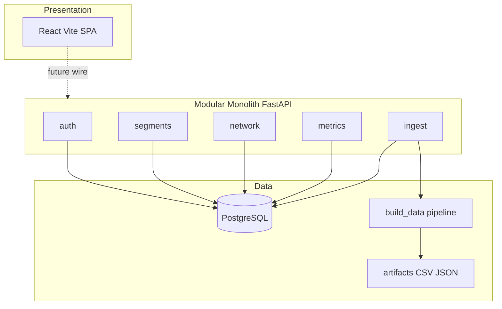
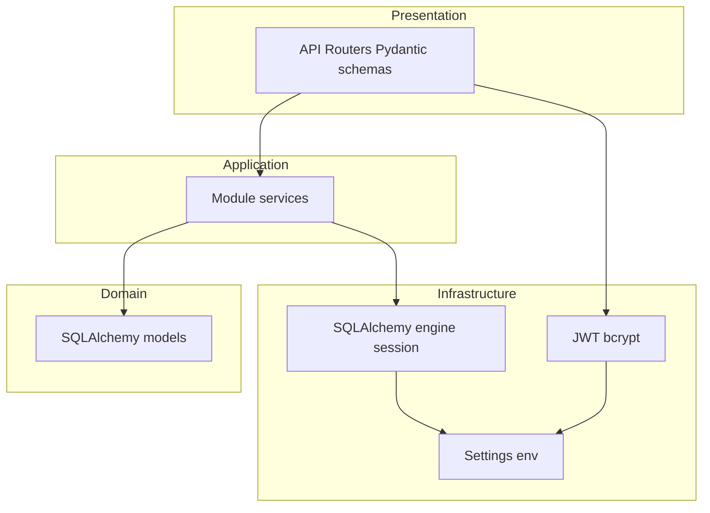

# PipelineGuard AI — Target Architecture

## Current state (pre-backend)

Assessment via `senior-architect` scripts (2026-07-16):

| Signal | Result |
|--------|--------|
| Detected pattern | `feature_based` (confidence 66%) — React `src/components` SPA |
| Backend layers | Missing (`controllers` / `services` / `repositories` not present) |
| npm deps | 14 direct; coupling score 0; 0 circular deps |
| Idle deps | `express`, `@google/genai` declared but unused in app code |
| Data | Static `src/lib/realData.json` from `scripts/build_data.py` |
| Auth | Demo credentials + `localStorage` |

> Note: scanning the whole repo includes gitignored `github_skills/`; app-relevant code is `src/`, `scripts/`, `artifacts/`.

## Target architecture

**Modular monolith** (FastAPI) + **PostgreSQL** as system of record + **JWT** auth stub.

### Module boundaries

Modules communicate only through their public routers/schemas — not by reaching into another module's internal repositories.

| Module | Responsibility |
|--------|----------------|
| `auth` | Login, JWT issue/validate, current user |
| `segments` | Pipeline segment risk records |
| `network` | Graph edges between nodes |
| `metrics` | Model metrics, SHAP, scenarios, stress, multi-seed |
| `ingest` | Import from artifacts / `realData.json` into DB |

### API surface (`/api/v1`)

| Method | Path | Auth |
|--------|------|------|
| POST | `/auth/login` | public |
| GET | `/auth/me` | JWT |
| GET | `/segments` | JWT |
| GET | `/segments/{id}` | JWT |
| GET | `/network/edges` | JWT |
| GET | `/metrics/model` | JWT |
| GET | `/metrics/shap` | JWT |
| GET | `/metrics/scenarios` | JWT |
| GET | `/metrics/stress` | JWT |
| GET | `/metrics/multi-seed` | JWT |
| POST | `/ingest/from-artifacts` | JWT |

### Layer diagram (backend)

## ADRs

- [001 — Modular monolith + FastAPI](adr/001-modular-monolith-fastapi.md)
- [002 — PostgreSQL as system of record](adr/002-postgresql-as-system-of-record.md)
- [003 — JWT auth stub](adr/003-jwt-auth-stub.md)

## Out of scope (this scaffold)

Wiring the React SPA to these endpoints (still uses static JSON + demo auth).
